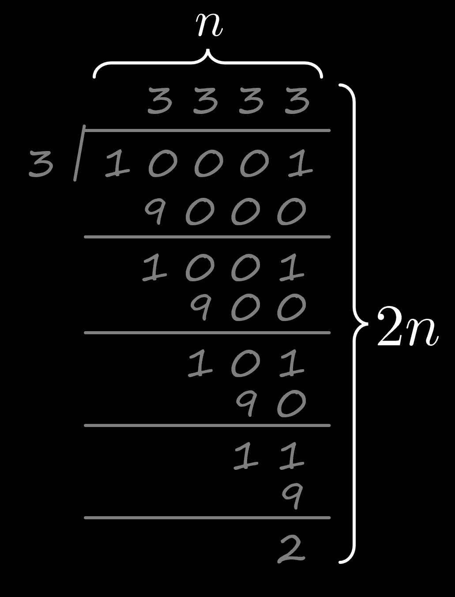

> Korean explanation of "MORE INFO" around 8:30

## 영상 8:30 부분 추가 설명

예/아니오로 대답해야 하는 수학 문제가 하나 있습니다. 
이 문제가 '얼마나 어려운지'를 어떻게 측정해야 할까요?

영상에 나왔던 예시를 들어 살펴봅시다. 
**"`x`는 소수인가?"** 라는 문제가 있습니다. 
`x`라는 수가 커질수록 이 문제를 풀기는 어려워집니다.

`x`가 `n`자리 숫자라고 해 봅시다. 
영상에서 제가 연필과 지우개를 써서 문제를 푼 방식은 아래와 같습니다.

`n=5`일 때, 5자리 수인 10001이 소수인지 알아내는 데에 필요한 공간의 크기는 대략 이 정도입니다.
 
일반화를 해보면, `n * 2n = 2n²`개의 글자가 들어갈 공간이 있으면 이 문제를 연필과 지우개로 풀 수 있습니다.

즉, "`x`는 소수인가?"라는 예/아니오 문제는 `n`이 증가할수록(문제의 길이가 길어질수록) 풀기 어려워집니다.

---

저는 "`x`는 소수인가?"라는 문제를 `2n²`의 공간만 써서 푼 것인데, `2n²`은 문제의 길이 `n`에 관한 다항식입니다. 
이를 다른 말로 "다항 공간(Polynomial SPACE)" 안에서 문제를 풀었다고 합니다.

`P = PSPACE인가?`라는 질문이 의미하는 바는 다음과 같습니다.

> 만약 어떤 예/아니오 문제를 연필과 지우개로 "다항 공간" 안에서 풀 수 있다면,
그 문제는 연필만 사용해도 "다항 공간" 안에서 풀 수 있는가?

영상에서는 설명을 단순화하기 위해 "연필과 지우개로 풀 수 있다면, 연필만으로도 **비슷한** 양의 종이를 사용해서 풀 수 있는가?"라고 했는데, 
'비슷한'이라는 단어는 사실 부정확합니다. 
엄청 더 많은 종이를 쓰더라도 그 크기가 "다항식"이기만 하면 사실 `P = PSPACE`임이 증명됩니다. 

현재 학계에서는 압도적으로 `P ≠ PSPACE`라는 쪽이 정설입니다. 
즉 "연필과 지우개가 있으면 다항 공간에서 풀 수 있지만, 연필만으로는 다항 공간에서 풀 수 **없는**" 문제가 **존재한다**는 것이 정설입니다.

---

## 계산 복잡도 이론에 이미 친숙한 사람들을 위한 추가 설명

### "연필과 지우개로 문제를 푼다"의 엄밀한 의미:

이건 그냥 튜링 기계가 하는 일을 쉬운 말로 표현한 것입니다.

### "연필만으로 문제를 푼다"의 엄밀한 의미:

튜링 기계의 작동 방식을 살짝 바꾸어, 
특정 칸(cell)의 상태를 변경할 때 원래 기호를 새로운 기호로 대체하는 것이 아니라, 
원래 기호 아래에다가 새로운 기호를 적도록 했다고 상상해 봅시다. 
매 단계마다 이 튜링 기계는 현재 칸에서 가장 아래에 적힌 기호를 읽습니다.

예를 들면 다음과 같이 작동하는 것입니다.

(화살표가 있는 위치가 튜링 기계의 머리입니다.)

---

어떤 문제를 **다항 시간**에 푸는 튜링 기계를 생각해 봅시다. 
저희가 살짝 변형한 이 튜링 기계도 같은 상태전이 함수(transition function)를 가지기만 한다면 똑같은 문제를 다항 시간에 풀 수 있습니다. 
(튜링 기계의 머리를 위아래로 움직이는 데에 드는 시간까지 고려해도 다항 시간입니다.)

반대로, 이 살짝 변형된 튜링 기계가 어떤 문제를 **다항 공간** 안에서 풀었다면, 그 과정은 다항 시간이 걸립니다. 
해당 튜링 기계가 적은 기호의 개수가 다항식으로 표현될 것이기 때문입니다.

이러한 관점에서, 다항 시간에 풀 수 있는 문제의 집합 P는 "연필만으로 다항 공간에서 풀 수 있는 문제의 집합"이라고 할 수 있습니다.
